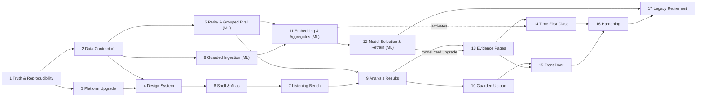

# Roadmap: ReefRadar v2 — Reef Soundscape Research Instrument

## Overview

ReefRadar v2 turns a demo wrapped in unsupported claims into a listening instrument where every sound, label and number is real, traceable and honestly qualified. The journey starts with a blocking truth pass (real audio only, verified model, reproducible build, captured baselines), then publishes a small versioned data contract that becomes the single seam between two parallel tracks. The **UI / product track** builds foundations (Next.js 16, one map/chart stack, light scientific-editorial design system), then vertical slices: the instrument shell and Atlas, the Listening Bench, analysis-as-search (results, then guarded uploads), evidence pages, time as a first-class dimension, and the question-led front door, before responsive/accessibility/performance hardening and gated legacy retirement. The **Data & ML track** fixes train/serve preprocessing parity and grouped evaluation first, ingests MARRS and Hurricane Irma data under a spend ceiling, embeds everything with the shared preprocessing library, and retrains on real data only — publishing new contract versions that the UI picks up without a redeploy.

## Tracks and Cross-Track Gates

| Track | Phases | Notes |
|-------|--------|-------|
| Shared gate | 1, 2 | Truth & Reproducibility, then Data Contract v1. Everything else depends on these. |
| UI / product | 3, 4, 6, 7, 9, 10, 13, 14, 15, 16, 17 | Runs against contract fixtures; never blocked by ingestion. |
| Data & ML | 5, 8, 11, 12 | Runs in parallel with UI phases; publishes immutable contract versions. |

**Hard cross-track gates (binding):**

- Phase 1 (truth + baselines) precedes all other work; Phase 2 (contract v1) precedes every instrument, bench, analysis and evidence UI phase.
- Phase 5 (shared `reef_audio` preprocessing + per-window live pipeline) precedes Phase 9 (analysis as search) and Phase 11 (any large batch embedding).
- Phase 8 establishes the budget alarm and verified MARRS timezone before large transfers; Phase 11 runs a pilot-cost shard before the full embedding job.
- Phase 5 delivers leave-one-site-out evaluation before Phase 12 retrains.
- Phase 14 (time features) is built against contract coverage flags but only activates when Phase 11 publishes aggregates.
- Phase 17 (legacy retirement) runs last and only after CAPABILITY-MATRIX sign-off.

## Phases

**Phase Numbering:**

- Integer phases (1, 2, 3): Planned milestone work
- Decimal phases (2.1, 2.2): Urgent insertions (marked with INSERTED)

Decimal phases appear between their surrounding integers in numeric order. Numeric order is a valid execution order; the **Depends on** fields allow Data & ML phases to run in parallel with UI phases.

- [ ] **Phase 1: Truth & Reproducibility** - Real audio only, verified model, reproducible build from git, CI test harness and pre-redesign baselines
- [ ] **Phase 2: Data Contract v1** - Versioned, immutable contract with full per-site provenance and coverage flags becomes the app's only reference-data source
- [ ] **Phase 3: Platform Upgrade & Stack Consolidation** - Next.js 16 / React 19, one map and chart stack, feature-module fence, monitoring, vitality layer retired
- [ ] **Phase 4: Design System & Instrument Primitives** - Light scientific-editorial tokens, CVD-safe status palette, dark spectrogram wells, accessible primitives, fixtures route
- [ ] **Phase 5: Preprocessing Parity & Grouped Evaluation** - [Data & ML] Shared `reef_audio` library, per-window live pipeline, all-site similarity, OOD, leave-one-site-out evaluation
- [ ] **Phase 6: Instrument Shell & Atlas** - One workspace (Atlas, Inspector, Bench) with semantic-zoom map, sound-space layout, filters, site table and URL state
- [ ] **Phase 7: Listening Bench** - Real spectrograms, attribution, band isolation, fair A/B/C comparison and the South Sulawesi recovery ladder
- [ ] **Phase 8: Guarded Upstream Ingestion** - [Data & ML] Budget alarm, verified MARRS timezone, MARRS audio + manifest + detections and Irma pre/post in S3
- [ ] **Phase 9: Analysis Results as Search** - Recordings placed among playable references with per-window readings, abstain, coverage and permalinks
- [ ] **Phase 10: Guarded Public Upload** - Validated presigned uploads with caps and rate limits, real progress, actionable failures, own-recording A/B
- [ ] **Phase 11: Batch Embedding & Contract Aggregates** - [Data & ML] Pilot-gated batch embedding of all ingested audio and UI-ready aggregates published in a new contract version
- [ ] **Phase 12: Model Selection & Real-Data Retrain** - [Data & ML] SurfPerch vs Perch 2.0 under grouped evaluation, calibrated real-data classifier with abstain, model card release
- [ ] **Phase 13: Evidence Pages & Exports** - Site, dataset, methods/model-card and about pages, provenance on every number, citations and exports
- [ ] **Phase 14: Time as a First-Class Dimension** - Effort calendars, diel fingerprints, detection timelines, Irma pre/post and synchronized time selections
- [ ] **Phase 15: Front Door, Investigations & Command Palette** - Question-led landing, real-audio stories, guided tour, command palette, local saved investigations and history
- [ ] **Phase 16: Responsive, Accessibility & Performance Hardening** - Text/table alternatives, AA contrast, global reduced motion, phone sheets, enforced performance budgets
- [ ] **Phase 17: Legacy Retirement & Final Verification** - Capability-matrix sign-off, legacy redirects, final regression walk and visual review

## Phase Details

### Phase 1: Truth & Reproducibility

**Goal**: Everything the product serves is real, attributed and honestly labelled, the deployed system is reproducible from git, and the pre-redesign app is captured as a regression baseline.
**Depends on**: Nothing (first phase)
**Track**: Shared gate
**Requirements**: TRUTH-01, TRUTH-02, TRUTH-03, TRUTH-04, TRUTH-05, TRUTH-06, TRUTH-07, TRUTH-08, TRUTH-09, TRUTH-10, PLAT-04
**Success Criteria** (what must be TRUE):

  1. A fresh clone of the repository installs, builds and runs the app (gallery and samples included) with no uncommitted local files; CI runs unit, component, end-to-end, axe and screenshot visual-regression suites on every push; and visual, accessibility and bundle-size baselines of the current app are stored in the repo.
  2. Every deployed Lambda, including the `/samples` route, is built from repository source, and a drift check reports that deployed code matches git.
  3. Every playable clip anywhere in the product is a real recording from a cited dataset; no sample references a site absent from the reference dataset (e.g. `phl_D1` is gone) and sample labels match site labels (e.g. `aus_R1`).
  4. The live classifier's version, classes and training data are recorded; no class trained on synthetic audio is served; displayed class probabilities are unmodified model outputs that sum to 100%.
  5. A reviewer reading every route finds no claim the system did not measure (no species claims, fabricated crossfade states or scripted processing messages), corrected and consistent citations/DOIs (MARRS Williams et al. 2025, SurfPerch arXiv 2404.16436, Irma DOI), and dataset-specific labels shown with who assigned them and what they mean.

**Plans**: 12/20 plans executed (12 waves)

Plans:
**Wave 1**

- [x] 01-01-PLAN.md — Test tooling behind the package-legitimacy gate (Vitest, Playwright + axe, pytest + moto)
- [x] 01-02-PLAN.md — Canonical citations module + checker; repo docs corrected
- [x] 01-03-PLAN.md — Real MARRS excerpts (16 kHz, 0 dB) + provenance manifest + real-audio checker

**Wave 2** *(blocked on Wave 1 completion)*

- [x] 01-04-PLAN.md — Pre-change visual and axe baselines of the deployed app
- [x] 01-05-PLAN.md — Deterministic Lambda packaging, drift check and scripted deploy (offline)
- [x] 01-06-PLAN.md — Site label provenance, generated gallery content, post-truth API fixtures

**Wave 3** *(blocked on Wave 2 completion)*

- [x] 01-07-PLAN.md — Recover gallery source from deployed bundle; build from git; bundle baseline; Next 14.2 patch

**Wave 4** *(blocked on Wave 3 completion)*

- [x] 01-08-PLAN.md — CI on every push (lint, types, unit, e2e, axe, Python, citations, Docker visual)

**Wave 5** *(blocked on Wave 4 completion)*

- [x] 01-09-PLAN.md — AWS access check + recover deployed Lambda source into git (drift green)

**Wave 6** *(blocked on Wave 5 completion)*

- [x] 01-10-PLAN.md — Deployed model audit and interim decision

**Wave 7** *(blocked on Wave 6 completion)*

- [x] 01-11-PLAN.md — Classifier: raw probabilities, honest region object, no fake projection
- [x] 01-12-PLAN.md — Router: label provenance on /sites, /samples from real-audio manifest
- [ ] 01-13-PLAN.md — Interim real-only classifier (if required) + model-card data

**Wave 8** *(blocked on Wave 7 completion)*

- [ ] 01-14-PLAN.md — Owner-approved production deploy, live verification, synthetic clips retired
- [ ] 01-15-PLAN.md — Results UI: integer probabilities summing to 100, region note, honest caveats
- [ ] 01-16-PLAN.md — Real /status stages, polling fix, embedding scatter removed

**Wave 9** *(blocked on Wave 8 completion)*

- [ ] 01-17-PLAN.md — Audio surfaces on real excerpts; crossfader/demo/Location Compare copy

**Wave 10** *(blocked on Wave 9 completion)*

- [ ] 01-18-PLAN.md — Gallery and sample view truth (fallback from manifest, reference-label wording)

**Wave 11** *(blocked on Wave 10 completion)*

- [ ] 01-19-PLAN.md — Label provenance on site surfaces, derived counts, about page citations

**Wave 12** *(blocked on Wave 11 completion)*

- [ ] 01-20-PLAN.md — Exit gate: banned-claims CI test, drift + live sweep, preview, Linux visual baselines

**UI hint**: no

### Phase 2: Data Contract v1

**Goal**: The web app reads all reference data from one versioned, immutable contract, so UI phases build against fixtures while the Data & ML track publishes later versions without blocking them.
**Depends on**: Phase 1
**Track**: Shared gate
**Requirements**: CONTRACT-01, CONTRACT-02, CONTRACT-03, CONTRACT-04, CONTRACT-05
**Success Criteria** (what must be TRUE):

  1. Contract v1 (dataset, model and preprocessing-spec versions plus schemas) is published to CDN-served storage, and the app obtains site/reference data only from it — a lint fence fails any module other than the contract module that fetches contract artifacts.
  2. All 54 sites in contract v1 carry source, DOI, licence, label definition, who assigned the label, and acoustic-reference vs location-only status; the 48 embedded sites carry honest projection coordinates (PCA with explained variance).
  3. The schema declares coverage flags (diel, detections, pre/post event, effort); publishing a fixture contract version with a flag changed is picked up by the running app without a redeploy.
  4. A URL or result pinned to a contract version resolves exactly that version even after a newer version is published as latest, and the analysis-result schema carries dataset, model and preprocessing version stamps.
  5. The app runs end to end against committed contract fixtures with no dependency on ingestion or ML jobs.

**Plans**: TBD
**UI hint**: no

### Phase 3: Platform Upgrade & Stack Consolidation

**Goal**: The dashboard runs on a modern, single-engine stack with the bioluminescent vitality layer removed, while every legacy route keeps working.
**Depends on**: Phase 1
**Track**: UI / product (can run in parallel with Phase 2)
**Requirements**: PLAT-01, PLAT-02, PLAT-03, PLAT-09, PLAT-10, DS-07
**Success Criteria** (what must be TRUE):

  1. The dashboard runs on Next.js 16 / React 19 and every legacy route (`/dashboard`, `/dashboard/*`, `/experience`, `/sites`, analyzer, map, compare) still works, passing its end-to-end checks with visual diffs against Phase 1 baselines reviewed and accepted.
  2. Only MapLibre renders maps and only Observable Plot + d3 render charts; wavesurfer, deck.gl, Leaflet, recharts and the Streamlit dashboard are gone from dependencies and the repository.
  3. The vitality store, colour engine, background canvas, caustics/particles, decorative spectrogram and dev vitality panel are removed, and legacy pages render cleanly without them (visual review).
  4. New code lives in feature modules and lint fails on any import from legacy components; all flows go through a single API client honouring the configured API base URL, with React Query caching and security headers preserved.
  5. Production errors and web-vitals are reported to a monitoring destination the owner can open.

**Plans**: TBD
**UI hint**: yes

### Phase 4: Design System & Instrument Primitives

**Goal**: A light scientific-editorial design system and an accessible, data-shaped instrument component kit exist and can be reviewed in every state before any instrument screen is built.
**Depends on**: Phase 2, Phase 3
**Track**: UI / product
**Requirements**: DS-01, DS-02, DS-03, DS-04, DS-05, DS-06, DS-08
**Success Criteria** (what must be TRUE):

  1. One Tailwind v4 CSS-first token source defines typography, spacing, surfaces, rules, radii, elevation and focus, and the same tokens drive UI components, the map style and chart scales (changing a token visibly changes all three).
  2. The ordinal status palette (degraded → restored_early → restored_mid → healthy, plus a distinct neutral for unknown) passes colour-vision-deficiency simulation, is always paired with shape or text and never used as UI accent; spectrograms and waveforms render in dark wells with a documented perceptually uniform scale and dB colourbar.
  3. React Aria primitives (dialog, sheet, listbox, table, range/dual-range slider, toggle group, tooltip, command palette) are fully keyboard-operable and pass axe checks.
  4. A dev-only fixtures route renders every instrument primitive (Transport, Spectrogram, WindowStrip, BandToggle, CompareRow, ProvenanceChip/Why panel, StripPlot, ProbabilityBar with abstain, DataTable, data-driven Legend with counts, Empty/Error/Loading) in every state from contract fixtures, under screenshot visual regression and visual review.
  5. Motion is limited to continuity (selection, layout morph, playhead, view transitions), and with reduced-motion enabled no primitive animates.

**Plans**: TBD
**UI hint**: yes

### Phase 5: Preprocessing Parity & Grouped Evaluation

**Goal**: Offline jobs and the live analysis path share one preprocessing library, the live pipeline reads every 5 s window honestly with full similarity and OOD context, and the current model has honest grouped metrics.
**Depends on**: Phase 2
**Track**: Data & ML (runs in parallel with Phases 3, 4, 6, 7)
**Requirements**: ML-01, ML-02, ML-03, ML-06, ML-08
**Success Criteria** (what must be TRUE):

  1. One shared `reef_audio` library (anti-aliased resampling, consistent normalization, 5 s windowing) is imported by both the live Preprocessor/Classifier Lambdas and offline jobs, and a parity test shows the same audio yields identical windows and embeddings through both paths.
  2. Every new analysis classifies each 5 s window individually (never a mean-pooled embedding) and persists per-window probabilities and similarities, stamped with its pinned dataset, model and preprocessing versions.
  3. Every analysis returns similarity to all reference sites (not only top-3), projection coordinates with explained variance, and an out-of-distribution status computed from distance to training data and reported separately from class probabilities.
  4. A leave-one-site-out evaluation harness reports the current model's per-class and per-region metrics with bootstrap confidence intervals, and the report is stored as a versioned artifact for the model card.

**Plans**: TBD
**UI hint**: no

### Phase 6: Instrument Shell & Atlas

**Goal**: Users explore every reference site in one instrument workspace where map, table and Inspector stay in sync and every view state lives in the URL.
**Depends on**: Phase 4
**Track**: UI / product
**Requirements**: ATLAS-01, ATLAS-02, ATLAS-03, ATLAS-04, ATLAS-05, ATLAS-06, ATLAS-07, ATLAS-08, PERSIST-01
**Success Criteria** (what must be TRUE):

  1. Selecting a site or cluster anywhere (map, table, Inspector link) updates the Atlas, the persistent Inspector — which replaces popups and shows provenance — and the Bench area together.
  2. The Atlas shows all sites on MapLibre with semantic zoom (world → clusters with counts → individual sites with overlap offsets), region fly-to and reduced-motion support, and switches between geographic and sound-space layouts with an animated morph; every map and list distinguishes acoustic-reference from location-only sites.
  3. Filters for status, restoration stage, country/cluster, dataset and evidence availability show live counts and apply to the map and to a sortable, keyboard-navigable site table showing the same data.
  4. Opening a copied URL in a fresh browser restores layout, lens, filters, selection, compare set and zoom exactly.
  5. Navigation is reduced to Listen · Explore · Analyze · Methods with an accessible mobile menu (Escape closes, focus managed, aria state); end-to-end tests and a visual review of the workspace at desktop and tablet widths pass.

**Plans**: TBD
**UI hint**: yes

### Phase 7: Listening Bench

**Goal**: Users can hear, see and fairly compare real reef recordings with honest attribution, real spectrograms, band isolation and the South Sulawesi recovery ladder.
**Depends on**: Phase 6
**Track**: UI / product
**Requirements**: LISTEN-01, LISTEN-02, LISTEN-03, LISTEN-04, LISTEN-05, LISTEN-06, LISTEN-07, LISTEN-08, LISTEN-09, A11Y-02
**Success Criteria** (what must be TRUE):

  1. From the landing page a visitor hears a real, attributed reef recording within 5 seconds (verified by a timed end-to-end test), and every audio surface shows dataset, site, recording time, DOI and licence.
  2. Every clip plays with a real spectrogram (time, frequency and dB axes appropriate to its sample rate) and a synchronized playhead, and fish / grazing / snapping-shrimp band isolation works on every playback surface using one cited band table.
  3. User can compare two or three clips A/B/C with level-matched playback, a disclosure of how levels were normalized, and each clip's site, date and time of day visible; reference labels (assigned by dataset authors) are worded and styled differently from model readings.
  4. User can play the South Sulawesi recovery ladder — degraded, restored <3 months, restored 32–53 months, healthy — at one location, with each rung's definition shown and no implied continuous trajectory.
  5. The bench is fully keyboard-operable (play/pause, step by window, band toggles, compare swap) with visible focus, degrades gracefully when Web Audio is unavailable, respects autoplay policy, and passes visual review.

**Plans**: TBD
**UI hint**: yes

### Phase 8: Guarded Upstream Ingestion

**Goal**: MARRS timestamped audio, its recording manifest and sonotype detections, and Hurricane Irma pre/post recordings are in S3 under an enforced spend ceiling, with verified timestamps.
**Depends on**: Phase 2
**Track**: Data & ML (runs in parallel with UI Phases 3, 4, 6, 7)
**External gate**: owner sets the AWS spend ceiling and provides credentials before any transfer is submitted
**Requirements**: DATA-01, DATA-02, DATA-03, DATA-04, DATA-05, DATA-06
**Success Criteria** (what must be TRUE):

  1. An AWS budget ceiling and alarm with an automated stop action exist and have been test-fired before any batch transfer or compute job is submitted.
  2. The timezone of MARRS filename timestamps is verified against a dated reference event and documented before the manifest or any time-of-day product is built.
  3. The MARRS recording manifest (files, deployment windows, duty cycle per site) is ingested; a pilot transfer's measured cost is projected under the ceiling before the full run; and the ~542k one-minute files land in S3 cloud-to-cloud with checksums and a resumable manifest (an interrupted run resumes without re-transferring completed files).
  4. MARRS sonotype detections for all 15 sound types can be queried from a columnar store.
  5. Hurricane Irma pre/post recordings are ingested with `period: pre|post` and status `unknown`, never relabelled as health.

**Plans**: TBD
**UI hint**: no

### Phase 9: Analysis Results as Search

**Goal**: Users see an analysis as a search result — the recording placed among playable labelled references, read window by window with an honest "can't tell" — first through precomputed sample analyses, with a stable permalink for every result.
**Depends on**: Phase 5, Phase 7
**Track**: UI / product
**Requirements**: ANLZ-04, ANLZ-05, ANLZ-06, ANLZ-07, ANLZ-09, ANLZ-12, PERSIST-02, TIME-01
**Success Criteria** (what must be TRUE):

  1. Choosing "Analyze this" on any sample clip instantly opens its precomputed analysis in the same result view that uploads will use.
  2. The result ranks the nearest reference sites (each playable), shows similarity as rank among all references, and shows the recording's position in sound-space among reference sites with the projection's explained variance disclosed.
  3. The result shows per-window readings with agreement (e.g. "7 of 9 windows nearest healthy references") and an explicit "can't tell" state, and the bench window strip colours each 5 s window by reading with opacity by confidence, synchronized with playhead and spectrogram.
  4. Class probabilities appear only as secondary evidence — integer percentages summing to 100, only for classes the model has — and training coverage for the recording's region (or "location not provided") is shown separately from them.
  5. Every completed analysis has a permalink `/analyses/[id]` with per-route metadata and a link-preview image that reopens the identical result pinned to its original versions; end-to-end tests and visual review of the result view pass.

**Plans**: TBD
**UI hint**: yes

### Phase 10: Guarded Public Upload

**Goal**: Anyone can analyze their own reef recording safely — validated upload straight to S3, real pipeline progress, actionable failures — and hear it against its nearest reference.
**Depends on**: Phase 9
**Track**: UI / product (includes upload-path backend)
**Requirements**: ANLZ-01, ANLZ-02, ANLZ-03, ANLZ-08, ANLZ-10, ANLZ-11, PLAT-05, PLAT-06, PLAT-07, PERSIST-06
**Success Criteria** (what must be TRUE):

  1. User can drag-drop or keyboard-browse a WAV, sees upload requirements inline with a link to Methods, gets client-side format, size and duration (5 s – 10 min) checks, and can preview the recording with a live spectrogram before submitting.
  2. User can optionally provide coordinates by map click or validated entry, with a plain explanation of what providing them changes.
  3. Uploads go directly to S3 via presigned URL with server-enforced size and duration caps (a 60 s file at 96 kHz succeeds; an over-cap file is rejected server-side), upload and analyze are rate limited, and filenames are sanitized.
  4. Progress reflects real pipeline stages from `/status` with backoff and cancel; status is inline and never shows internal identifiers; failures show the stage, an actionable suggestion and a copyable request id, with retry or analyze-another.
  5. In the result, user can play back their own recording and A/B it against the nearest reference; the full upload → result flow passes end-to-end tests and visual review.

**Plans**: TBD
**UI hint**: yes

### Phase 11: Batch Embedding & Contract Aggregates

**Goal**: All ingested audio is embedded with the shared preprocessing library within budget, and UI-ready aggregates are published in a new immutable contract version that switches on the time features.
**Depends on**: Phase 5, Phase 8
**Track**: Data & ML
**Requirements**: DATA-07, DATA-08, DATA-09
**Success Criteria** (what must be TRUE):

  1. A pilot shard's measured throughput and cost per 1,000 windows is recorded and projected under the budget ceiling before the full embedding job is submitted.
  2. All ingested audio is windowed and embedded through `reef_audio` for each candidate embedding model, producing per-window embeddings with full provenance (source file, offset, preprocessing-spec and model versions).
  3. Precomputed aggregates — per site × hour-of-day, per site × date, detection counts, recording effort, reference spectrogram images and projection coordinates — are published in a new contract version with matching coverage flags, and `latest` flips only after every referenced artifact is durable.
  4. URLs and results pinned to the earlier contract version still resolve to that version.

**Plans**: TBD
**UI hint**: no

### Phase 12: Model Selection & Real-Data Retrain

**Goal**: A classifier trained only on real data, chosen by grouped evaluation, calibrated and given an explicit abstain threshold, is live with a published model card.
**Depends on**: Phase 11
**Track**: Data & ML (uses the leave-one-site-out harness from Phase 5)
**Requirements**: ML-04, ML-05, ML-07
**Success Criteria** (what must be TRUE):

  1. SurfPerch and Perch 2.0 embeddings are compared under the same leave-one-site-out evaluation with bootstrap confidence intervals, and the chosen model and its rationale are recorded.
  2. The retrained classifier is trained on real data only (no synthetic samples), calibrated, and has an explicit abstain threshold, with grouped per-class and per-region metrics and intervals recorded.
  3. Model artifacts, metrics and a model card are published as a versioned release in the contract, and the live classifier serves that release (a new analysis is stamped with the new model version).
  4. Analyses produced under the previous model version still open with their original versions and readings.

**Plans**: TBD
**UI hint**: no

### Phase 13: Evidence Pages & Exports

**Goal**: Users can inspect the evidence behind every number — sites, datasets, methods and model card, about — and take results away with their provenance intact.
**Depends on**: Phase 9
**Track**: UI / product (ships honest content from the current contract; model card upgrades in place when Phase 12 publishes)
**Requirements**: EVID-01, EVID-02, EVID-03, EVID-04, EVID-05, EVID-06, EVID-07, PERSIST-03
**Success Criteria** (what must be TRUE):

  1. Each `/sites/[id]` page shows the label and who assigned it, label definition, dataset/DOI/licence, location, recording effort, acoustic-reference flag, playable clips, nearest acoustic neighbours, paired sites at the same location and an external map link.
  2. Every displayed number opens a provenance view with source, version, unit, method and a path to the underlying data.
  3. The Methods page presents the model card (classes, training data, grouped evaluation with intervals, calibration, abstain rule, version, known gaps, synthetic-data history), what the system measures and cannot measure, the canonical band table and limitations, and every in-context caveat links to it; publishing a new model version updates it without a redeploy.
  4. A datasets view lists each source (site counts, DOI, licence, recorder, sample rate) with composition by status × country × source; an About page has a keyboard-accessible architecture diagram and credits; the footer shows attribution, licence, data/model versions and live API status with an honest last-checked time.
  5. User can copy BibTeX/APA citations for each dataset and the model release, and export a result or the site list as JSON/CSV with a provenance block of pinned versions; end-to-end tests and visual review of all evidence pages pass.

**Plans**: TBD
**UI hint**: yes

### Phase 14: Time as a First-Class Dimension

**Goal**: Users can see when each reef was recorded and how it sounds across the day, the deployment and Hurricane Irma, with time selections synchronized across every view.
**Depends on**: Phase 13
**Track**: UI / product
**Activation gate**: views are built against contract coverage flags and activate only when Phase 11 publishes aggregates; the phase completes only once activation is verified on a published contract
**Requirements**: TIME-02, TIME-03, TIME-04, TIME-05, TIME-06, TIME-07
**Success Criteria** (what must be TRUE):

  1. Each site shows a recording-effort calendar (deployment window, duty cycle, days recorded); where a coverage flag is off, the view states honestly that the data is not available rather than drawing an empty chart.
  2. Each MARRS site shows a diel soundscape fingerprint in verified local time and a detection timeline for the 15 sonotypes, and user can compare diel fingerprints of sites side by side (e.g. healthy vs degraded at one location).
  3. User can compare Hurricane Irma pre- and post-event recordings for the same reef, with status shown as unknown rather than health.
  4. Selecting a playhead second, hour-of-day or date range synchronizes all views and appears in the URL; reloading restores it.
  5. With the aggregate contract published, these views activate without a redeploy and show real data; end-to-end tests and visual review pass.

**Plans**: TBD
**UI hint**: yes

### Phase 15: Front Door, Investigations & Command Palette

**Goal**: Visitors enter through curated questions that open real instrument states, and returning users can find anything fast and keep their investigations locally.
**Depends on**: Phase 10, Phase 13
**Track**: UI / product
**Requirements**: FRONT-01, FRONT-02, FRONT-03, ATLAS-09, PERSIST-04, PERSIST-05
**Success Criteria** (what must be TRUE):

  1. The landing page is question-led: each curated question opens a pre-configured instrument state, and real reef audio is still playable within 5 seconds of landing.
  2. A curated real-audio sample collection is organized into stories built from honest comparisons (e.g. one location's recovery ladder).
  3. An optional short guided tour drives the live instrument (never a separate scroll-driven page) and can be exited at any step.
  4. A keyboard-invoked command palette jumps to sites, clusters, clips, questions and methods topics.
  5. User can save named investigations with notes locally (no account), see recent analyses and views in local history, and reopen either after restarting the browser; end-to-end tests and visual review pass.

**Plans**: TBD
**UI hint**: yes

### Phase 16: Responsive, Accessibility & Performance Hardening

**Goal**: The whole product works for keyboard and screen-reader users, on desktop, tablet and phone, within enforced performance budgets.
**Depends on**: Phase 14, Phase 15
**Track**: UI / product
**Requirements**: A11Y-01, A11Y-03, A11Y-04, A11Y-05, A11Y-06, A11Y-07, PLAT-08
**Success Criteria** (what must be TRUE):

  1. Every chart and map offers a text summary and a data-table alternative, and every clip has a text description of its measured content for screen-reader users.
  2. Status is never conveyed by colour alone, all text meets WCAG 2.2 AA contrast, and CI reports zero serious or critical axe violations on every route.
  3. With reduced motion requested, no CSS transition, motion-library animation or canvas animates beyond essential state changes.
  4. Desktop and tablet layouts are first-class; on phones the instrument becomes focused sheets supporting listening, viewing results and sharing, with touch targets of at least 44 px (visual review at every breakpoint).
  5. CI enforces instrument LCP under 2.0 s on mid-tier mobile and select/hover/scrub interactions under 100 ms, and no animation loop runs while the app is idle.

**Plans**: TBD
**UI hint**: yes

### Phase 17: Legacy Retirement & Final Verification

**Goal**: Every preserved capability has a verified home in the new product, legacy routes are retired behind redirects, and the milestone passes a final regression and visual review.
**Depends on**: Phase 12, Phase 16
**Track**: Shared (gated on CAPABILITY-MATRIX sign-off)
**Requirements**: MIGR-01, MIGR-02, MIGR-03
**Success Criteria** (what must be TRUE):

  1. A signed-off walk of `.planning/audit/CAPABILITY-MATRIX.md` shows every non-retired row has a verified home in the new IA before any legacy route is removed.
  2. `/dashboard`, `/dashboard/*`, `/experience` and the `/sites` list are removed and redirect to their new homes, so old bookmarks land on equivalent states.
  3. A final capability-matrix regression walk and visual review across all routes and breakpoints, compared against Phase 1 baselines, is recorded with no open regressions, and the live system serves the retrained model from Phase 12.

**Plans**: TBD
**UI hint**: no

## Progress

**Execution Order:**
Numeric order (1 → 17) is a valid order. With parallelization, Data & ML phases run alongside UI phases once their dependencies are met:

- After Phase 2: Phase 5 and Phase 8 (Data & ML) run alongside Phases 3/4/6/7 (UI).
- Phase 9 waits on Phase 5 and Phase 7; Phase 11 waits on Phase 5 and Phase 8; Phase 12 waits on Phase 11.
- Phase 14 can be built after Phase 13 but completes only after Phase 11 publishes aggregates.
- Phase 17 waits on Phase 12 and Phase 16.

| Phase | Plans Complete | Status | Completed |
|-------|----------------|--------|-----------|
| 1. Truth & Reproducibility | 12/20 | In Progress|  |
| 2. Data Contract v1 | 0/TBD | Not started | - |
| 3. Platform Upgrade & Stack Consolidation | 0/TBD | Not started | - |
| 4. Design System & Instrument Primitives | 0/TBD | Not started | - |
| 5. Preprocessing Parity & Grouped Evaluation | 0/TBD | Not started | - |
| 6. Instrument Shell & Atlas | 0/TBD | Not started | - |
| 7. Listening Bench | 0/TBD | Not started | - |
| 8. Guarded Upstream Ingestion | 0/TBD | Not started | - |
| 9. Analysis Results as Search | 0/TBD | Not started | - |
| 10. Guarded Public Upload | 0/TBD | Not started | - |
| 11. Batch Embedding & Contract Aggregates | 0/TBD | Not started | - |
| 12. Model Selection & Real-Data Retrain | 0/TBD | Not started | - |
| 13. Evidence Pages & Exports | 0/TBD | Not started | - |
| 14. Time as a First-Class Dimension | 0/TBD | Not started | - |
| 15. Front Door, Investigations & Command Palette | 0/TBD | Not started | - |
| 16. Responsive, Accessibility & Performance Hardening | 0/TBD | Not started | - |
| 17. Legacy Retirement & Final Verification | 0/TBD | Not started | - |

---
*Roadmap created: 2026-09-30*
