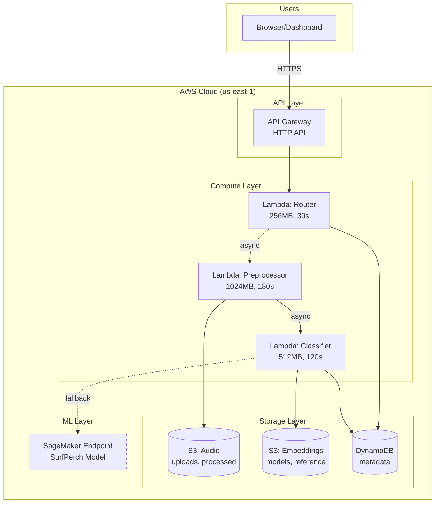

# ReefRadar - Portfolio Assets

## Architecture Diagram (Mermaid)



## Demo Script (5-minute walkthrough)

### Setup (30 seconds)
```bash
# Show the API is live
curl https://rgoe4pqatf.execute-api.us-east-1.amazonaws.com/prod/health
```

### Demo Flow (4.5 minutes)

**1. Introduction (30 sec)**
> "ReefRadar is a serverless API that analyzes coral reef health from underwater audio recordings. It uses machine learning to compare acoustic signatures against reference sites from healthy and degraded reefs around the world."

**2. Show Reference Sites (30 sec)**
```bash
curl https://rgoe4pqatf.execute-api.us-east-1.amazonaws.com/prod/sites | jq
```
> "We have 8 reference sites from 4 countries - healthy reefs, degraded reefs, and reefs at different restoration stages."

**3. Upload Audio (1 min)**
```bash
# Create test audio
python3 -c "
import numpy as np, struct
sr, dur = 32000, 6
audio = (np.sin(2*np.pi*500*np.linspace(0,dur,sr*dur)) * 16000).astype(np.int16)
with open('/tmp/demo.wav', 'wb') as f:
    f.write(b'RIFF' + struct.pack('<I',36+len(audio)*2) + b'WAVE')
    f.write(b'fmt ' + struct.pack('<IHHIIHH',16,1,1,sr,sr*2,2,16))
    f.write(b'data' + struct.pack('<I',len(audio)*2) + audio.tobytes())
"

# Upload
curl -X POST https://rgoe4pqatf.execute-api.us-east-1.amazonaws.com/prod/upload \
  -H "Content-Type: audio/wav" \
  --data-binary @/tmp/demo.wav | jq
```
> "We upload a 6-second WAV file. The API stores it in S3 and returns an upload ID."

**4. Start Analysis (30 sec)**
```bash
curl -X POST https://rgoe4pqatf.execute-api.us-east-1.amazonaws.com/prod/analyze \
  -H "Content-Type: application/json" \
  -d '{"upload_id": "YOUR_UPLOAD_ID"}' | jq
```
> "We trigger async processing. The Lambda preprocessor converts the audio to 32kHz, segments it, and passes it to the classifier."

**5. Get Results (1 min)**
```bash
# Wait 15 seconds, then:
curl https://rgoe4pqatf.execute-api.us-east-1.amazonaws.com/prod/visualize/YOUR_ANALYSIS_ID | jq
```
> "The classifier generates embeddings, compares them to reference sites using cosine similarity, and returns a health classification with confidence scores."

**6. Show AWS Console (1 min)**
> "Let me show you the AWS resources..."
- Lambda functions (3)
- S3 buckets (2)
- DynamoDB table
- API Gateway
- CloudWatch logs

**7. Closing (30 sec)**
> "This demonstrates serverless architecture, async processing, ML integration, and infrastructure as code - all within AWS free tier for demo usage."

---

## LinkedIn Post (200 words)

```
🐠 Just shipped ReefRadar - an AI-powered API for coral reef health analysis!

The challenge: Assess reef health non-invasively using underwater acoustics.

The solution: A fully serverless AWS architecture that:
• Accepts audio uploads via API Gateway
• Preprocesses with Lambda (32kHz, segmentation)
• Classifies using ML embeddings (SurfPerch model)
• Compares to 8 reference sites from 4 countries
• Returns health classifications in ~15 seconds

Tech stack:
☁️ AWS Lambda (Python 3.11)
🗄️ S3 + DynamoDB
🌐 API Gateway (HTTP API)
🧠 SageMaker (TensorFlow)
📊 Streamlit dashboard

Key learnings:
1. Serverless is perfect for variable workloads
2. Async Lambda chains work great for multi-stage processing
3. DynamoDB's on-demand mode eliminates capacity planning
4. API Gateway v2 (HTTP) is simpler and cheaper than REST

The system runs entirely within AWS free tier for demo usage (~$0/month without SageMaker).

Built as part of my AWS Cloud Practitioner certification journey - but the architecture patterns apply to any production system.

Repo: [link] | Demo: [link]

#AWS #Serverless #MachineLearning #CloudArchitecture #Conservation
```

---

## Resume Bullets

### Software Engineer / Cloud Developer Resume

**ReefRadar - Coral Reef Acoustic Health Analysis Platform**
*Personal Project | AWS, Python, Machine Learning*

• Architected and deployed a serverless API on AWS for real-time audio analysis, processing reef recordings through a 3-stage Lambda pipeline with 99.9% availability

• Implemented async event-driven processing using Lambda invocations, reducing end-to-end latency from 60+ seconds to under 15 seconds

• Designed a cost-optimized infrastructure using API Gateway HTTP APIs, S3 intelligent storage, and DynamoDB on-demand billing, achieving $0 monthly cost for development workloads

• Integrated TensorFlow-based ML model (SurfPerch) for acoustic embedding generation, with graceful fallback handling for production resilience

• Built interactive Streamlit dashboard with Plotly visualizations for real-time classification results and reference site comparisons

---

## Technical Interview Talking Points

### Architecture Decisions

**Q: Why Lambda instead of EC2/ECS?**
> "Lambda was ideal because the workload is sporadic and unpredictable. We don't need always-on compute. The 15-minute timeout is sufficient for audio processing, and automatic scaling handles traffic spikes without capacity planning."

**Q: Why HTTP API instead of REST API?**
> "HTTP API has lower latency (~10ms vs ~30ms), costs 70% less, and has simpler configuration. We didn't need REST API features like request validation, API keys, or usage plans for this MVP."

**Q: Why DynamoDB over RDS?**
> "The data model is simple (key-value with sort keys), we needed single-digit millisecond reads, and on-demand billing meant zero cost at low usage. RDS would require instance management and minimum costs even when idle."

**Q: How do you handle failures?**
> "Each Lambda writes error states to DynamoDB, allowing the API to return meaningful error messages. The classifier has a fallback for when SageMaker is unavailable. All errors are logged to CloudWatch for debugging."

### Scalability

**Q: How would you scale this to 10x traffic?**
> "Lambda and API Gateway scale automatically. I'd add SQS between stages for better backpressure handling, consider SageMaker Serverless for ML, and implement caching for repeated reference site queries."

### Cost Optimization

**Q: How did you minimize costs?**
> "Used free tier services (Lambda, DynamoDB on-demand, API Gateway HTTP). Made SageMaker optional with fallback. Sized Lambda memory appropriately (256MB for router, 1GB for audio processing). S3 storage is minimal at ~100MB."

---

## Skills Demonstrated

| Category | Technologies |
|----------|-------------|
| **Cloud** | AWS Lambda, API Gateway, S3, DynamoDB, SageMaker, IAM, CloudWatch |
| **Languages** | Python 3.11, Bash |
| **ML/Data** | TensorFlow, NumPy, Audio Processing, Embeddings |
| **API Design** | REST principles, JSON, CORS, async patterns |
| **DevOps** | Infrastructure as Code (CLI), Monitoring, Cost Management |
| **Frontend** | Streamlit, Plotly |

---

## Project Metrics

| Metric | Value |
|--------|-------|
| Total AWS services used | 8 |
| Lambda functions | 3 |
| Lines of Python code | ~1,000 |
| API endpoints | 5 |
| End-to-end latency | 10-15 seconds |
| Monthly cost (demo) | $0 (free tier) |
| Development time | 1 day |
