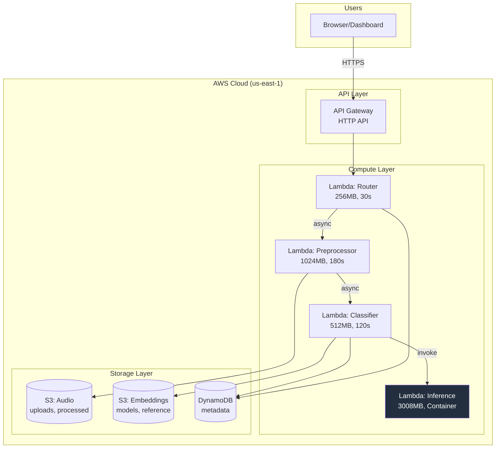

# ReefRadar - Portfolio Assets

## Architecture Diagram (Mermaid)


```mermaid
flowchart TB
    subgraph Users
        A[Browser/Dashboard]
    end

    subgraph AWS["AWS Cloud (us-east-1)"]
        subgraph API["API Layer"]
            B[API Gateway<br/>HTTP API]
        end

        subgraph Compute["Compute Layer"]
            C[Lambda: Router<br/>256MB, 30s]
            D[Lambda: Preprocessor<br/>1024MB, 180s]
            E[Lambda: Classifier<br/>512MB, 120s]
            F[Lambda: Inference<br/>3008MB, Container]
        end

        subgraph Storage["Storage Layer"]
            G[(S3: Audio<br/>uploads, processed)]
            H[(S3: Embeddings<br/>models, reference)]
            I[(DynamoDB<br/>metadata)]
        end
    end

    A -->|HTTPS| B
    B --> C
    C -->|async| D
    C --> I
    D -->|async| E
    D --> G
    E -->|invoke| F
    E --> H
    E --> I

    style F fill:#232f3e,color:#fff
```

## Demo Script (5-minute walkthrough)

### Setup (30 seconds)
```bash
# Show the API is live
curl https://rgoe4pqatf.execute-api.us-east-1.amazonaws.com/prod/health
```

### Demo Flow (4.5 minutes)

**1. Introduction (30 sec)**
> "ReefRadar is a serverless API that analyzes coral reef health from underwater audio recordings. It uses machine learning to compare acoustic signatures against 54 reference sites from 7 countries."

**2. Show Reference Sites (30 sec)**
```bash
curl https://rgoe4pqatf.execute-api.us-east-1.amazonaws.com/prod/sites | jq
```
> "We have 54 reference sites across 7 countries -- healthy reefs, degraded reefs, and reefs at different restoration stages, sourced from MARRS, Hurricane Irma, CoralSoundExplorer, and NOAA SanctSound datasets."

**3. Upload Audio (1 min)**
```bash
# Create test audio
python3 -c "
import numpy as np, struct
sr, dur = 32000, 6
audio = (np.sin(2*np.pi*500*np.linspace(0,dur,sr*dur)) * 16000).astype(np.int16)
with open('/tmp/demo.wav', 'wb') as f:
    f.write(b'RIFF' + struct.pack('<I',36+len(audio)*2) + b'WAVE')
    f.write(b'fmt ' + struct.pack('<IHHIIHH',16,1,1,sr,sr*2,2,16))
    f.write(b'data' + struct.pack('<I',len(audio)*2) + audio.tobytes())
"

# Upload
curl -X POST https://rgoe4pqatf.execute-api.us-east-1.amazonaws.com/prod/upload \
  -H "Content-Type: audio/wav" \
  --data-binary @/tmp/demo.wav | jq
```
> "We upload a 6-second WAV file. The API stores it in S3 and returns an upload ID."

**4. Start Analysis (30 sec)**
```bash
curl -X POST https://rgoe4pqatf.execute-api.us-east-1.amazonaws.com/prod/analyze \
  -H "Content-Type: application/json" \
  -d '{"upload_id": "YOUR_UPLOAD_ID"}' | jq
```
> "We trigger async processing. The Lambda preprocessor converts the audio to 32kHz, segments it, and passes it to the classifier which invokes the inference Lambda container for real SurfPerch embeddings."

**5. Get Results (1 min)**
```bash
# Wait 15 seconds, then:
curl https://rgoe4pqatf.execute-api.us-east-1.amazonaws.com/prod/visualize/YOUR_ANALYSIS_ID | jq
```
> "The classifier generates real SurfPerch embeddings, runs them through a trained MLP, compares to 54 reference sites using cosine similarity, and returns a health classification with confidence scores."

**6. Show AWS Console (1 min)**
> "Let me show you the AWS resources..."
- Lambda functions (4, including container-based inference)
- S3 buckets (2)
- DynamoDB table
- API Gateway
- ECR container registry
- CloudWatch logs

**7. Closing (30 sec)**
> "This demonstrates serverless architecture, async processing, containerized ML inference, and infrastructure as code -- all running at ~$0.11/month."

---

## LinkedIn Post (200 words)

```
Just shipped ReefRadar -- an AI-powered API for coral reef health analysis from underwater audio.

The challenge: Assess reef health non-invasively using underwater acoustics.

The solution: A fully serverless AWS architecture that:
- Accepts audio uploads via API Gateway
- Preprocesses with Lambda (32kHz resampling, segmentation)
- Generates real SurfPerch embeddings via Lambda container (TensorFlow)
- Classifies using a trained MLP with geographic region detection
- Compares to 54 reference sites across 7 countries
- Returns health classifications in ~15-30 seconds

Tech stack:
  AWS Lambda (Python 3.11, including container-based inference)
  S3 + DynamoDB
  API Gateway (HTTP API)
  TensorFlow + perch-hoplite (SurfPerch model)
  Next.js 14 dashboard (Vercel)

Key learnings:
1. Lambda containers enable real ML inference without SageMaker
2. Async Lambda chains work great for multi-stage processing
3. DynamoDB's on-demand mode eliminates capacity planning
4. API Gateway v2 (HTTP) is simpler and cheaper than REST

The system runs at ~$0.11/month -- entirely within AWS free tier for demo usage.

Built as part of my IME 400 capstone project at Cal Poly.

Repo: [link] | Demo: [link]

#AWS #Serverless #MachineLearning #CloudArchitecture #Conservation
```

---

## Resume Bullets

### Software Engineer / Cloud Developer Resume

**ReefRadar - Coral Reef Acoustic Health Analysis Platform**
*Capstone Project | AWS, Python, Next.js, Machine Learning*

- Architected a 4-Lambda serverless pipeline on AWS for real-time audio classification, including a container-based inference Lambda running TensorFlow/SurfPerch for embedding generation

- Built a trained MLP classifier (~90% test accuracy) on SurfPerch embeddings with geographic region detection, comparing recordings against 54 reference sites across 7 countries

- Implemented async event-driven processing using Lambda invocations, reducing end-to-end latency to 15-30 seconds including cold starts

- Designed a cost-optimized infrastructure using API Gateway HTTP APIs, S3, and DynamoDB on-demand billing, achieving ~$0.11/month operational cost

- Developed an interactive Next.js 14 dashboard with real-time audio playback, spectrogram visualization, and interactive reference site mapping

---

## Technical Interview Talking Points

### Architecture Decisions

**Q: Why Lambda instead of EC2/ECS?**
> "Lambda was ideal because the workload is sporadic and unpredictable. We don't need always-on compute. The 15-minute timeout is sufficient for audio processing, and automatic scaling handles traffic spikes without capacity planning."

**Q: Why a Lambda container for ML inference instead of SageMaker?**
> "We initially used SageMaker but it cost $83/month idle. Lambda containers support up to 10GB images with 3GB memory, which is enough for TensorFlow + SurfPerch. This eliminated all idle costs while keeping real ML inference."

**Q: Why HTTP API instead of REST API?**
> "HTTP API has lower latency (~10ms vs ~30ms), costs 70% less, and has simpler configuration. We didn't need REST API features like request validation, API keys, or usage plans for this MVP."

**Q: Why DynamoDB over RDS?**
> "The data model is simple (key-value with sort keys), we needed single-digit millisecond reads, and on-demand billing meant zero cost at low usage. RDS would require instance management and minimum costs even when idle."

**Q: How do you handle failures?**
> "Each Lambda writes error states to DynamoDB, allowing the API to return meaningful error messages. The classifier handles inference Lambda failures gracefully. All errors are logged to CloudWatch for debugging."

### Scalability

**Q: How would you scale this to 10x traffic?**
> "Lambda and API Gateway scale automatically. I'd add SQS between stages for better backpressure handling, implement caching for repeated reference site queries, and consider provisioned concurrency for the inference Lambda to reduce cold starts."

### Cost Optimization

**Q: How did you minimize costs?**
> "Replaced a $83/month SageMaker endpoint with a Lambda container at zero idle cost. Used free tier services (Lambda, DynamoDB on-demand, API Gateway HTTP). Sized Lambda memory appropriately (256MB for router, 1GB for audio processing, 3GB for inference)."

---

## Skills Demonstrated

| Category | Technologies |
|----------|-------------|
| **Cloud** | AWS Lambda (including containers), API Gateway, S3, DynamoDB, ECR, CodeBuild, IAM, CloudWatch |
| **Languages** | Python 3.11, TypeScript, Bash |
| **ML/Data** | TensorFlow, SurfPerch, NumPy, Audio Processing, Embeddings, MLP Classifier |
| **API Design** | REST principles, JSON, CORS, async patterns |
| **DevOps** | Infrastructure as Code (CLI), Container builds, CI/CD (CodeBuild), Cost Management |
| **Frontend** | Next.js 14, React, Tailwind CSS, Leaflet maps, Web Audio API |

---

## Project Metrics

| Metric | Value |
|--------|-------|
| Total AWS services used | 9 |
| Lambda functions | 4 (including container) |
| Reference sites | 54 across 7 countries |
| Lines of Python code | ~1,500 |
| API endpoints | 6 |
| End-to-end latency | 15-30 seconds |
| Monthly cost (demo) | ~$0.11 |
