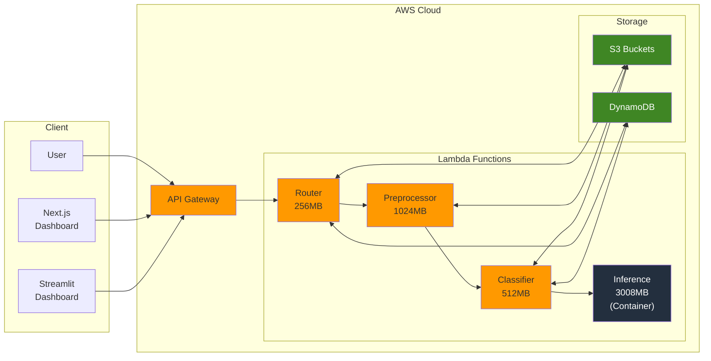

# ReefRadar - Coral Reef Acoustic Health Analysis System

A serverless AWS-based system for analyzing coral reef health through underwater acoustic recordings using machine learning. Uses the SurfPerch bioacoustics model to generate 1280-dimensional acoustic embeddings, then classifies reef health status with a trained MLP classifier.

**API Endpoint:** `https://rgoe4pqatf.execute-api.us-east-1.amazonaws.com/prod`
**Region:** `us-east-1`
**Project Prefix:** `reefradar-2477`

## Live Demo

**Next.js Dashboard:** Deploy to Vercel by following the [Deployment Guide](./docs/DEPLOYMENT.md). After deployment, the dashboard will be available at your Vercel project URL (e.g., `https://reefradar-dashboard.vercel.app`).

The dashboard provides:
- Interactive reef health analysis with audio upload
- Reference site map with health status visualization
- Side-by-side audio comparison between healthy and degraded reefs
- Real-time analysis progress tracking

## Table of Contents

- [Live Demo](#live-demo)
- [Architecture Overview](#architecture-overview)
- [AWS Resources](#aws-resources)
- [API Reference](#api-reference)
- [Quick Start](#quick-start)
- [Methodology](#methodology)
- [Cost Analysis](#cost-analysis)
- [Known Limitations](#known-limitations)

---

## Architecture Overview

> **Detailed Diagrams:** See [Architecture Diagrams](./docs/ARCHITECTURE_DIAGRAMS.md) for interactive Mermaid diagrams.



### Data Flow

1. **Upload** (`POST /upload`)
   - User uploads WAV file via API or Dashboard
   - Router Lambda stores file in S3 (`uploads/{upload_id}/`)
   - Metadata recorded in DynamoDB

2. **Analyze** (`POST /analyze`)
   - Router triggers Preprocessor Lambda asynchronously
   - Optionally accepts `latitude`/`longitude` for geographic region detection
   - Returns `analysis_id` immediately (202 Accepted)

3. **Preprocess** (Async)
   - Downloads audio from S3
   - Converts to 32kHz mono, 16-bit PCM
   - Segments into 5-second chunks (160,000 samples each)
   - Stores segments as JSON in S3
   - Forwards coordinates to Classifier

4. **Classify** (Async)
   - Invokes Inference Lambda to generate real SurfPerch embeddings
   - Classifies using trained MLP (1280->256->64->4, ~90% test accuracy)
   - Detects geographic region and adjusts confidence if out-of-distribution
   - Compares to 8 reference site embeddings via cosine similarity
   - Stores results in DynamoDB

5. **Visualize** (`GET /visualize/{analysis_id}`)
   - Returns classification, similar sites, region info, and visualization data

---

## AWS Resources

### Lambda Functions

| Function | Memory | Timeout | Runtime | Purpose |
|----------|--------|---------|---------|---------|
| `reefradar-2477-router` | 256 MB | 30s | Python 3.11 | API routing, upload handling |
| `reefradar-2477-preprocessor` | 1024 MB | 180s | Python 3.11 + numpy | Audio processing |
| `reefradar-2477-classifier` | 512 MB | 120s | Python 3.11 + numpy | MLP classification + region detection |
| `reefradar-2477-inference` | 3008 MB | 300s | Container (Python 3.12) | SurfPerch embedding generation |

### S3 Buckets

| Bucket | Purpose |
|--------|---------|
| `reefradar-2477-audio` | User uploads (`uploads/`), processed audio (`processed/`) |
| `reefradar-2477-embeddings` | Reference embeddings (`reference/metadata.json`), Lambda layers |

### Other Resources

| Resource | Name |
|----------|------|
| DynamoDB | `reefradar-2477-metadata` (on-demand, pk/sk schema) |
| API Gateway | HTTP API, `$default` route, CORS enabled |
| ECR | `reefradar-2477-inference` (SurfPerch container) |
| CodeBuild | `reefradar-2477-inference-build` (container build pipeline) |
| Lambda Layer | `reefradar-2477-numpy` (numpy 1.26.4) |

---

## API Reference

### Base URL
```
https://rgoe4pqatf.execute-api.us-east-1.amazonaws.com/prod
```

### Endpoints

#### GET /health
Health check.

```bash
curl https://rgoe4pqatf.execute-api.us-east-1.amazonaws.com/prod/health
```
```json
{"status": "healthy", "timestamp": "2026-02-20T12:00:00.000000"}
```

#### GET /sites
List reference sites with health status.

```bash
curl https://rgoe4pqatf.execute-api.us-east-1.amazonaws.com/prod/sites
```

#### POST /upload
Upload a WAV file. Returns `upload_id`.

```bash
curl -X POST .../upload -H "Content-Type: audio/wav" --data-binary @recording.wav
```

#### POST /analyze
Start analysis. Optionally include coordinates for region detection.

```bash
curl -X POST .../analyze -H "Content-Type: application/json" \
  -d '{"upload_id": "UUID", "latitude": -4.93, "longitude": 119.32}'
```

Returns `analysis_id`. Poll `/visualize/{analysis_id}` for results.

#### GET /visualize/{analysis_id}
Get analysis results (poll until `status: "complete"`).

```json
{
  "analysis_id": "...",
  "status": "complete",
  "classification": {
    "label": "healthy",
    "confidence": 0.87,
    "probabilities": {"healthy": 0.87, "degraded": 0.04, "restored_early": 0.05, "restored_mid": 0.04},
    "region": {
      "detected": "INDO_PACIFIC_WEST",
      "name": "Indo-Pacific West (Indonesia/Philippines)",
      "in_training_distribution": true,
      "confidence_adjusted": false
    }
  },
  "similar_sites": [
    {"site_id": "ind_H4", "country": "Indonesia", "similarity": 0.94, "status": "healthy"}
  ],
  "caveats": "..."
}
```

#### GET /status/{analysis_id}
Get detailed processing stage (preprocessing, classifying, complete, failed).

---

## Quick Start

### Test the API

```bash
# 1. Health check
curl https://rgoe4pqatf.execute-api.us-east-1.amazonaws.com/prod/health

# 2. Create test audio (6 seconds, 32kHz)
python3 << 'EOF'
import numpy as np, struct
sr, dur = 32000, 6
t = np.linspace(0, dur, sr * dur)
audio = (np.sin(2*np.pi*500*t) * 0.5 * 32767).astype(np.int16)
with open('/tmp/test.wav', 'wb') as f:
    f.write(b'RIFF' + struct.pack('<I', 36 + len(audio)*2) + b'WAVE')
    f.write(b'fmt ' + struct.pack('<IHHIIHH', 16, 1, 1, sr, sr*2, 2, 16))
    f.write(b'data' + struct.pack('<I', len(audio)*2) + audio.tobytes())
EOF

# 3. Upload
UPLOAD=$(curl -s -X POST .../upload -H "Content-Type: audio/wav" --data-binary @/tmp/test.wav)
UPLOAD_ID=$(echo $UPLOAD | python3 -c "import sys,json; print(json.load(sys.stdin)['upload_id'])")

# 4. Analyze (with optional coordinates)
ANALYZE=$(curl -s -X POST .../analyze -H "Content-Type: application/json" \
  -d "{\"upload_id\": \"$UPLOAD_ID\", \"latitude\": -4.93, \"longitude\": 119.32}")
ANALYSIS_ID=$(echo $ANALYZE | python3 -c "import sys,json; print(json.load(sys.stdin)['analysis_id'])")

# 5. Poll for results (allow ~30s for cold start + processing)
sleep 30
curl .../visualize/$ANALYSIS_ID
```

### Run the Next.js Dashboard

```bash
cd dashboard-next
npm install
npm run dev
# Open http://localhost:3000
```

### Run the Streamlit Dashboard

```bash
cd dashboard
pip install -r requirements.txt
streamlit run app.py
# Open http://localhost:8501
```

---

## Methodology

### What It Measures

ReefRadar analyzes **biological sound activity** - the acoustic signatures produced by reef-associated fauna (fish vocalizations, snapping shrimp, invertebrate sounds). These soundscapes serve as a proxy for reef biodiversity and ecosystem health.

### ML Pipeline

1. **Audio Preprocessing**: WAV files are resampled to 32kHz mono and segmented into 5.0-second windows (160,000 samples)
2. **Embedding Generation**: Each segment is processed by the [SurfPerch model](https://www.kaggle.com/models/google/surfperch) (Google Research), producing a 1280-dimensional acoustic embedding
3. **Classification**: A trained MLP classifier (1280->256->64->4 architecture, ~90% test accuracy) classifies the mean embedding into one of four categories
4. **Region Detection**: If coordinates are provided, geographic region is detected and confidence is adjusted for out-of-distribution regions

### Health Categories

| Category | Description |
|----------|-------------|
| `healthy` | Diverse fish communities, abundant snapping shrimp, complex acoustic signatures |
| `degraded` | Reduced acoustic diversity, lower biological sound production |
| `restored_early` | Recently restored (<3 months), initial signs of acoustic recovery |
| `restored_mid` | Mid-restoration (32-53 months), soundscapes approaching healthy characteristics |

### Reference Data

8 reference sites with real SurfPerch embeddings from the [MARRS coral reef restoration dataset](https://doi.org/10.5281/zenodo.6024203):

- **Indonesia (South Sulawesi)**: ind_H4, ind_H5 (healthy), ind_D2, ind_D3 (degraded), ind_N1 (restored early), ind_R1, ind_R2 (restored mid)
- **Kenya (Lamu)**: ken_H1 (healthy)

### What It Cannot Measure

- Direct coral tissue health, bleaching status, or disease
- Fish species counts or population dynamics
- Water quality parameters (temperature, pH, turbidity)

Acoustic monitoring measures biological sound activity, not coral tissue health directly. Results should be combined with visual surveys and environmental data for comprehensive reef assessment.

---

## Cost Analysis

### Current Monthly Costs

| Service | Cost |
|---------|------|
| Lambda | Free tier (~$0) |
| S3 | ~$0.01 |
| DynamoDB | Free tier (~$0) |
| API Gateway | Free tier (~$0) |
| ECR | ~$0.10 |
| **Total** | **< $1/month** |

SageMaker resources have been deleted. All ML inference runs on Lambda containers with no idle costs.

### Projected Costs at Scale

| Usage Level | Monthly Cost |
|-------------|--------------|
| Development (10 req/day) | ~$0 (free tier) |
| Demo (100 req/day) | ~$0.50 |
| Light Production (1000 req/day) | ~$5 |

---

## Known Limitations

1. **Cold Start Latency**: The inference Lambda container has cold starts of 5-30 seconds. First analysis after idle period takes longer.

2. **Geographic Coverage**: Model trained on Indo-Pacific (Indonesia) and Indian Ocean (Kenya) reef data only. Results from other regions (Caribbean, Red Sea, etc.) have reduced confidence with automatic warnings.

3. **Temporal Limitation**: Training data from specific recording periods. Reef soundscapes vary seasonally and diurnally.

4. **WSL2 Port Forwarding**: Dashboards may not be accessible from Windows browser without port forwarding:
   ```powershell
   netsh interface portproxy add v4tov4 listenport=3000 listenaddress=0.0.0.0 connectport=3000 connectaddress=$(wsl hostname -I)
   ```

---

## Data Sources

- **MARRS Foundation** -- Mars Assisted Reef Restoration System monitoring data, 45 sites across Indonesia, Australia, Kenya, Maldives, Mexico. DOI: [10.5522/04/29958062](https://doi.org/10.5522/04/29958062) (CC BY 4.0)
- **Hurricane Irma Reef Acoustics** -- Simmons, Bohnenstiehl & Eggleston (2021). Pre/post hurricane reef soundscapes, Florida Keys. DOI: [10.5061/dryad.5tb2rbp38](https://doi.org/10.5061/dryad.5tb2rbp38) (CC0)
- **CoralSoundExplorer** -- Minier et al. (2025). Bora-Bora reef soundscapes, French Polynesia. DOI: [10.5281/zenodo.14577064](https://doi.org/10.5281/zenodo.14577064) (CC BY 4.0)
- **NOAA SanctSound** -- Sanctuary Soundscape Monitoring Project, Florida Keys National Marine Sanctuary (Public Domain)

---

## Dashboard Deployment

The Next.js dashboard (`dashboard-next/`) is configured for deployment on **Vercel** (free Hobby tier). See the full [Deployment Guide](./docs/DEPLOYMENT.md) for step-by-step instructions.

**Quick deploy:**

```bash
# Install Vercel CLI
npm install -g vercel

# Log in (requires browser)
vercel login

# Link and deploy from dashboard-next/
cd dashboard-next
vercel link
vercel env add NEXT_PUBLIC_API_URL  # Value: https://rgoe4pqatf.execute-api.us-east-1.amazonaws.com/prod
vercel --prod
```

After connecting the GitHub repository in Vercel settings (with root directory set to `dashboard-next`), pushes to `main` trigger production deployments automatically, and pull requests create preview deployments.

---

## Credits

- **SurfPerch Model:** Google Research (bird-vocalization-classifier, adapted for underwater acoustics)
- **Reference Data:** [MARRS Coral Reef Restoration Monitoring](https://doi.org/10.5281/zenodo.6024203) - University of Exeter
- **Built with:** AWS Lambda, Next.js 14, TensorFlow, perch-hoplite
- **Dashboard Hosting:** [Vercel](https://vercel.com)
