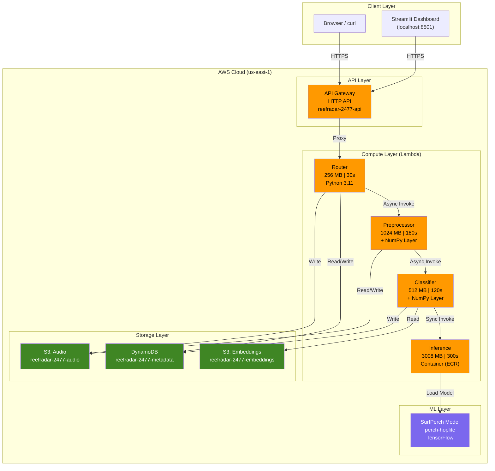
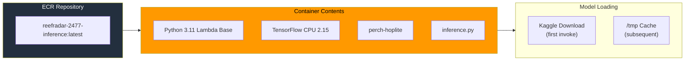
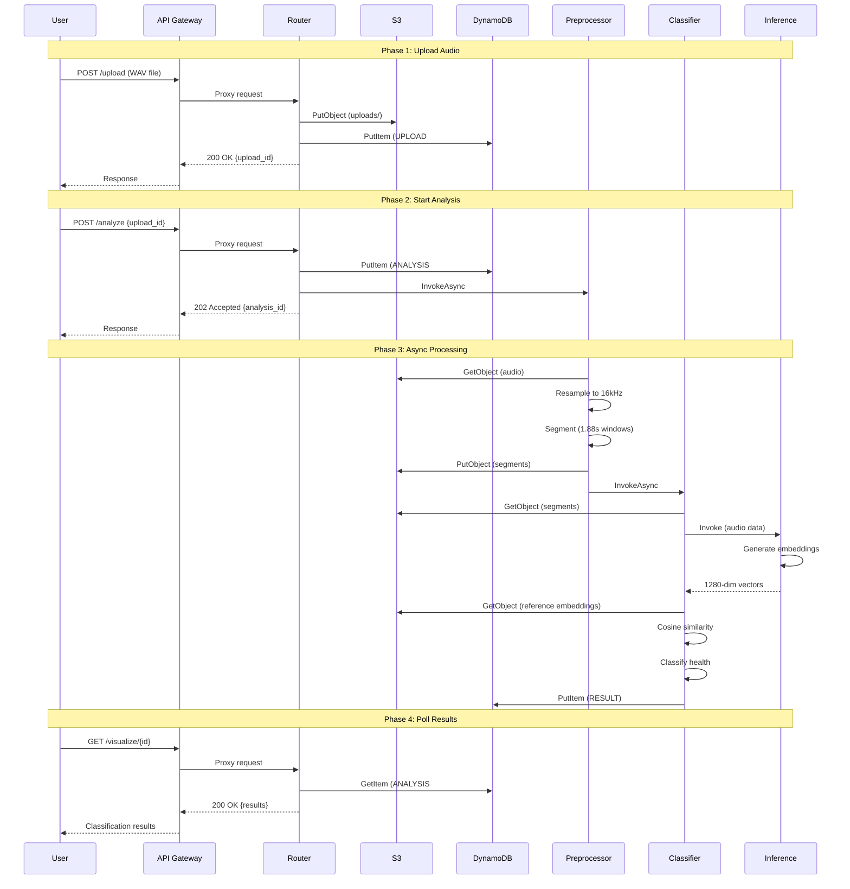
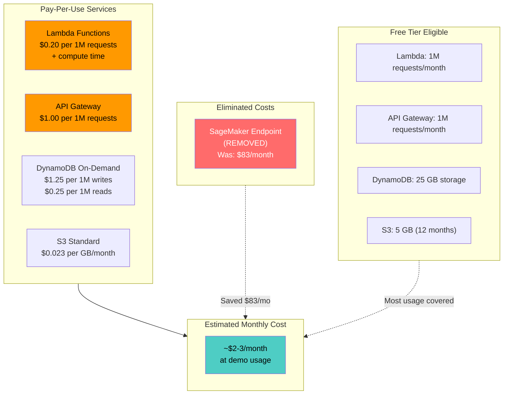
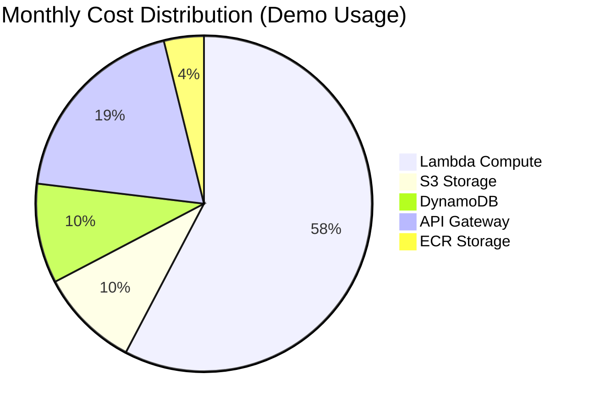
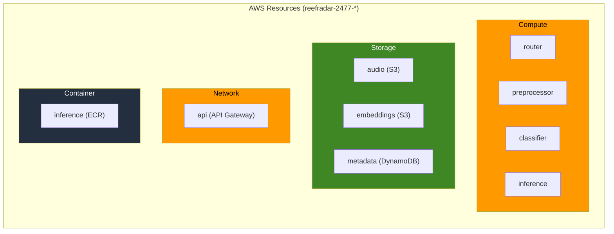

# ReefRadar Architecture Diagrams

This document contains Mermaid-based architecture diagrams for the ReefRadar coral reef acoustic health analysis system. All diagrams render natively on GitHub.

## Table of Contents

- [1. High-Level System Architecture](#1-high-level-system-architecture)
- [2. Data Flow Pipeline](#2-data-flow-pipeline)
- [3. Lambda Function Details](#3-lambda-function-details)
- [4. Request-Response Sequence](#4-request-response-sequence)
- [5. Cost Architecture](#5-cost-architecture)

---

## 1. High-Level System Architecture

This diagram shows all major AWS components and how they connect.

### Legend
| Color | Service Type |
|-------|--------------|
| Orange | AWS Lambda / API Gateway (Compute) |
| Green | Storage Services (S3, DynamoDB) |
| Purple | ML / AI Components |

---

## 2. Data Flow Pipeline

This diagram shows the step-by-step processing of audio data through the system.

```mermaid
flowchart LR
    subgraph Upload["1. Upload Phase"]
        A1["WAV File<br/>(any sample rate)"] -->|POST /upload| A2["Router Lambda"]
        A2 -->|Store| A3["S3: uploads/"]
        A2 -->|Record| A4["DynamoDB<br/>UPLOAD#id"]
    end

    subgraph Process["2. Processing Phase"]
        B1["POST /analyze"] -->|Trigger| B2["Preprocessor"]
        B2 -->|Download| B3["Original Audio"]
        B3 -->|Convert| B4["16kHz Mono<br/>Float32"]
        B4 -->|Segment| B5["1.88s Windows<br/>(30,080 samples)"]
        B5 -->|Store| B6["S3: processed/"]
    end

    subgraph Classify["3. Classification Phase"]
        C1["Classifier Lambda"] -->|Load Segments| C2["Audio Segments"]
        C2 -->|Invoke| C3["Inference Lambda"]
        C3 -->|Generate| C4["1280-dim<br/>Embeddings"]
        C4 -->|Compare| C5["Reference<br/>Embeddings"]
        C5 -->|Calculate| C6["Cosine<br/>Similarity"]
        C6 -->|Classify| C7["Health Status"]
    end

    subgraph Results["4. Results Phase"]
        D1["Classification<br/>Results"] -->|Store| D2["DynamoDB<br/>ANALYSIS#id"]
        D3["GET /visualize"] -->|Query| D2
        D2 -->|Return| D4["JSON Response"]
    end

    A4 -.->|upload_id| B1
    B6 -.->|Trigger| C1
    C7 -->|Save| D1
```

### Data Transformations

| Stage | Input | Output | Format |
|-------|-------|--------|--------|
| Upload | WAV (any format) | Raw audio | Binary in S3 |
| Resample | Any sample rate | 16kHz mono | Float32 array |
| Segment | Full audio | 1.88s windows | 30,080 samples each |
| Embed | Audio segment | Feature vector | 1280 dimensions |
| Classify | Embeddings | Health label | JSON with probabilities |

---

## 3. Lambda Function Details

This diagram shows the Lambda invocation chain with deployment details.

```mermaid
flowchart TB
    subgraph Router["Router Lambda"]
        R1["reefradar-2477-router"]
        R2["Memory: 256 MB"]
        R3["Timeout: 30s"]
        R4["Runtime: Python 3.11"]
        R5["Deploy: ZIP"]
    end

    subgraph Preprocessor["Preprocessor Lambda"]
        P1["reefradar-2477-preprocessor"]
        P2["Memory: 1024 MB"]
        P3["Timeout: 180s"]
        P4["Runtime: Python 3.11"]
        P5["Layer: NumPy 1.26.4"]
        P6["Deploy: ZIP + Layer"]
    end

    subgraph Classifier["Classifier Lambda"]
        C1["reefradar-2477-classifier"]
        C2["Memory: 512 MB"]
        C3["Timeout: 120s"]
        C4["Runtime: Python 3.11"]
        C5["Layer: NumPy 1.26.4"]
        C6["Deploy: ZIP + Layer"]
    end

    subgraph Inference["Inference Lambda"]
        I1["reefradar-2477-inference"]
        I2["Memory: 3008 MB"]
        I3["Timeout: 300s"]
        I4["Runtime: Container"]
        I5["Image: ECR"]
        I6["Model: SurfPerch"]
    end

    Router -->|"Async<br/>InvocationType: Event"| Preprocessor
    Preprocessor -->|"Async<br/>InvocationType: Event"| Classifier
    Classifier -->|"Sync<br/>InvocationType: RequestResponse"| Inference

    style Router fill:#ff9900,color:#000
    style Preprocessor fill:#ff9900,color:#000
    style Classifier fill:#ff9900,color:#000
    style Inference fill:#232f3e,color:#fff
```

### Invocation Types

| From | To | Type | Reason |
|------|----|------|--------|
| API Gateway | Router | Sync | Must return HTTP response |
| Router | Preprocessor | Async | Non-blocking, returns immediately |
| Preprocessor | Classifier | Async | Non-blocking, long-running |
| Classifier | Inference | Sync | Needs embedding results |

### Container Details (Inference Lambda)

---

## 4. Request-Response Sequence

This sequence diagram shows the complete flow of an analysis request.

### Timing Characteristics

| Phase | Duration | Notes |
|-------|----------|-------|
| Upload | 1-2s | Depends on file size |
| Preprocessing | 3-5s | Audio conversion |
| Inference | 5-30s | Cold start can add 20s |
| Classification | 2-3s | Similarity computation |
| **Total** | **10-40s** | First request slower |

---

## 5. Cost Architecture

This diagram highlights the cost-optimized architecture design.

### Cost Comparison

### Cost by Usage Level

| Level | Analyses/Month | Est. Cost | Notes |
|-------|----------------|-----------|-------|
| Demo | 10-50 | $2-3 | Free tier covers most |
| Light | 100-500 | $5-15 | Minimal overage |
| Medium | 1,000-5,000 | $30-80 | Lambda costs dominate |
| Heavy | 10,000+ | $150+ | Consider reserved capacity |

---

## Resource Summary

---

## Quick Reference

### API Endpoints

| Method | Path | Purpose |
|--------|------|---------|
| GET | /health | Health check |
| GET | /sites | List reference sites |
| POST | /upload | Upload audio file |
| POST | /analyze | Start analysis |
| GET | /visualize/{id} | Get results |

### Key Metrics

- **Embedding Dimension**: 1280
- **Audio Segment Length**: 1.88 seconds (30,080 samples at 16kHz)
- **Reference Sites**: 6 validated MARRS locations
- **Classification Accuracy**: 90% (on test set)

---

*Diagrams created for portfolio presentation. All diagrams use Mermaid syntax and render natively on GitHub.*
