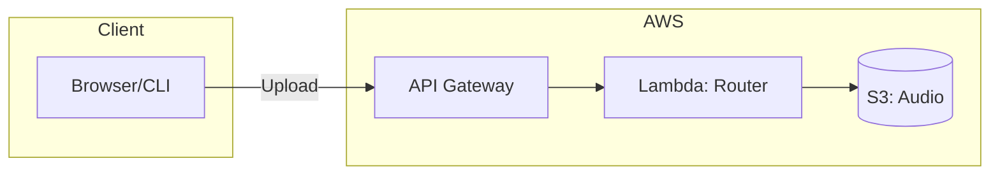
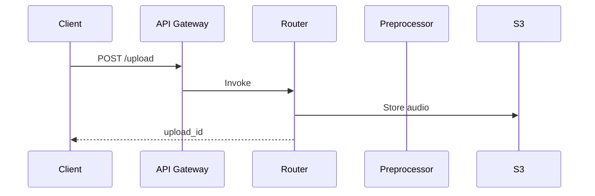

<objective>
Create AWS architecture diagrams using Mermaid markdown format. These diagrams will render on GitHub and can be embedded in documentation for portfolio presentation.

The diagrams should clearly communicate the system architecture to both technical and non-technical audiences.
</objective>

<context>
Read CLAUDE.md for project conventions.

Architecture reference:
@infrastructure/resources.json - Complete AWS resource inventory
@ARCHITECTURE.md - Text description of architecture
@docs/PROJECT_STATUS.md - Contains ASCII architecture diagram

Current architecture components:
- API Gateway: reefradar-2477-api
- Lambda Functions: router (256MB), preprocessor (1024MB), classifier (512MB), inference (3008MB container)
- S3 Buckets: audio, embeddings
- DynamoDB: metadata table
- ECR: inference container image

Data flow:
1. Client uploads audio → API Gateway → Router Lambda
2. Router → S3 (stores audio) → Preprocessor Lambda
3. Preprocessor → segments audio → Classifier Lambda
4. Classifier → Inference Lambda (SurfPerch embeddings) → S3 (results)
5. Client polls → API Gateway → Router → DynamoDB → Results
</context>

<requirements>

1. **System Architecture Diagram** (high-level):
   - Show all major AWS services
   - Include request/response flow
   - Color-code by service type (compute, storage, API)
   - Add clear labels

2. **Data Flow Diagram** (detailed):
   - Step-by-step processing pipeline
   - Show data transformations at each stage
   - Include file formats and sizes
   - Highlight async vs sync operations

3. **Lambda Function Details**:
   - Show each Lambda with memory/timeout
   - Illustrate invocation chain
   - Show container vs zip deployment

4. **Cost Diagram** (optional but valuable):
   - Show pay-per-use components
   - Highlight cost optimization (no SageMaker)
   - Indicate free tier eligible services

Mermaid diagram types to use:
- `flowchart LR/TB` for architecture
- `sequenceDiagram` for request flow
- `graph` for data pipeline
</requirements>

<implementation>
Mermaid syntax examples:





Style guidelines:
- Use subgraphs to group related services
- Add icons using FontAwesome if supported
- Keep diagrams readable (not too many nodes)
- Include legends for color coding
</implementation>

<constraints>
- Mermaid syntax only (no external tools required)
- Diagrams must render on GitHub
- Keep complexity reasonable (max 15-20 nodes per diagram)
- Use consistent naming with actual AWS resources
</constraints>

<output>
Create/update files:
- `./docs/ARCHITECTURE_DIAGRAMS.md` - All diagrams with explanations

Structure:
```markdown
# ReefRadar Architecture Diagrams

## System Overview
[Mermaid diagram]
[Brief explanation]

## Request Flow
[Sequence diagram]
[Explanation]

## Data Pipeline
[Flow diagram]
[Explanation]
```

Also update:
- `./ARCHITECTURE.md` - Add link to diagrams document
- `./README.md` - Add architecture diagram to main readme (if exists)
</output>

<verification>
1. All Mermaid diagrams render correctly (test with GitHub preview or mermaid.live)
2. Service names match infrastructure/resources.json
3. Data flow accurately represents actual implementation
4. Diagrams are readable and not cluttered
5. Each diagram has accompanying explanatory text
</verification>

<success_criteria>
- At least 3 Mermaid diagrams created
- Diagrams accurately represent deployed architecture
- Render correctly on GitHub
- Include explanatory text for each diagram
- Linked from main documentation
- Suitable for portfolio presentation
</success_criteria>
